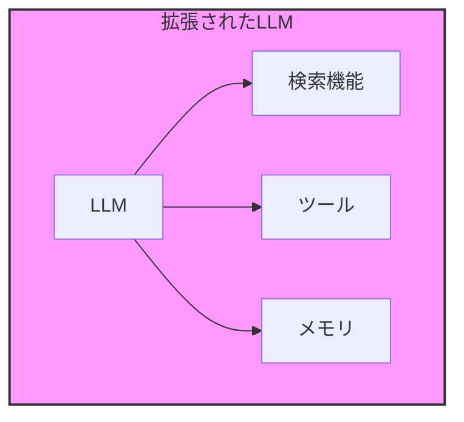
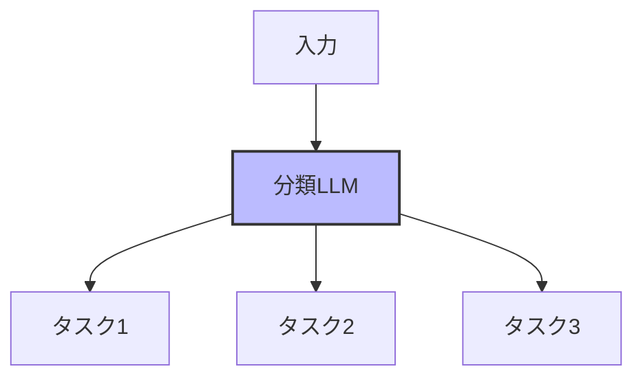
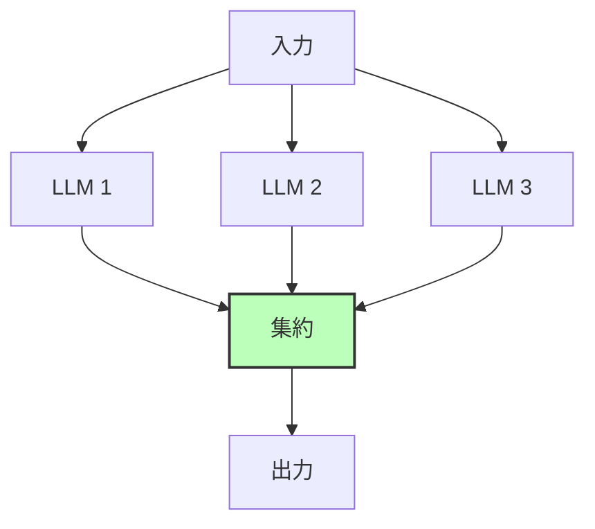
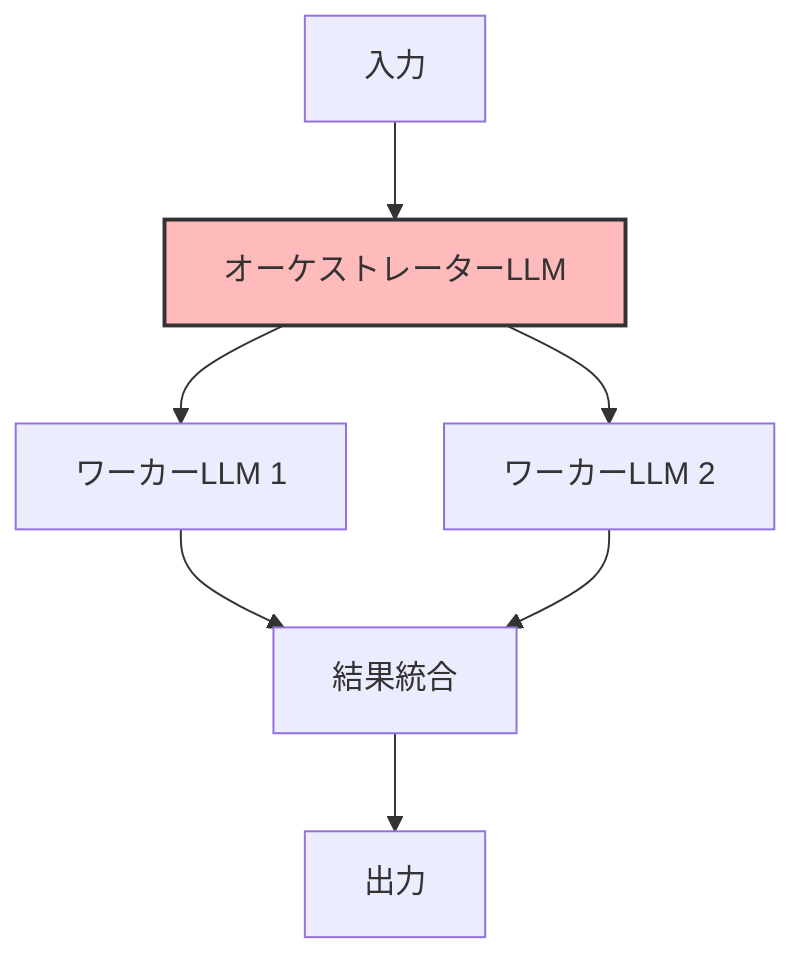
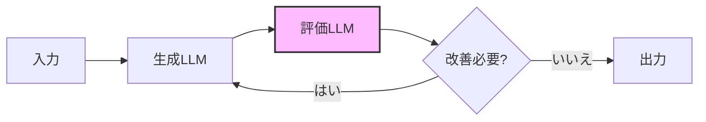
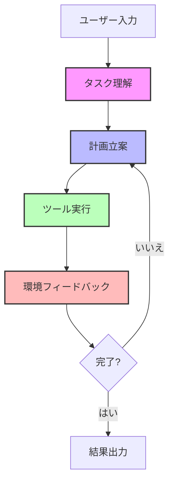

# AI エージェントアーキテクチャ解説

## 概要

AI エージェントは、LLM（大規模言語モデル）を基盤とした自律的なシステムです。主に 2 つのアーキテクチャパターンがあります：

1. **ワークフロー（Workflows）**

   - 事前定義されたコードパスに従って LLM とツールをオーケストレーション
   - 予測可能で一貫性のある処理が可能
   - 明確に定義されたタスクに適している

2. **エージェント（Agents）**
   - LLM が動的にプロセスとツールの使用を指揮
   - タスクの実行方法を自律的に制御
   - 柔軟性とモデル駆動の意思決定が必要な場合に適している

## 基本的なビルディングブロック

## 主要なワークフローパターン

### 1. プロンプトチェーン

### 2. ルーティング

### 3. 並列化

### 4. オーケストレーター-ワーカー

### 5. 評価者-最適化

## 自律エージェントの実装

## 実装のベストプラクティス

1. **シンプルさの維持**

   - 複雑なフレームワークは避け、必要最小限の実装を心がける
   - パフォーマンスとコストのバランスを考慮

2. **透明性の確保**

   - エージェントの計画ステップを明示的に表示
   - デバッグと監視を容易にする

3. **ツール設計の重要性**

   - 明確なドキュメントとテスト
   - エラーを防ぐための設計（ポカヨケ）
   - モデルが理解しやすい形式の選択

4. **フレームワークの使用**
   - 開始時は直接 LLM API を使用
   - 必要に応じて段階的に複雑さを追加
   - 基盤となるコードの理解を維持
